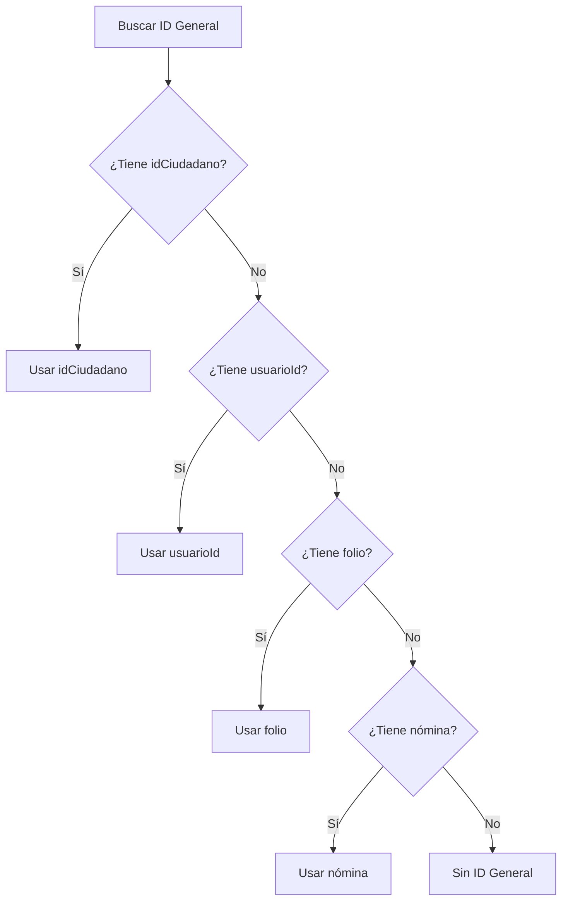

# 🔍 Corrección: ID General No Se Mostraba en Perfil

## 📋 **Problema Identificado**

### ❌ **Situación:**
- En la información personal del perfil **NO se estaba mostrando el ID General**
- El código dependía únicamente del campo `idCiudadano` que podía estar vacío
- No había fallbacks para obtener el ID General de otras fuentes

### 🔍 **Análisis del Problema:**
```dart
// ANTES - Lógica limitada:
if (usuario!.idCiudadano != null && usuario!.idCiudadano!.isNotEmpty) {
  // Solo mostraba si idCiudadano tenía valor
  identifiers.add(_buildInfoCard('ID General', idCiudadano, ...));
}
// ❌ Si idCiudadano estaba vacío, NO se mostraba nada
```

## ✅ **Solución Implementada**

### **Archivo corregido**: `lib/screens/perfil_usuario_screen.dart`

### **1. Método Helper Agregado:**

```dart
/// Método helper para obtener el ID General de cualquier fuente disponible
String _getIdGeneral() {
  if (usuario == null) return '';

  // Prioridad 1: idCiudadano
  if (usuario!.idCiudadano != null && usuario!.idCiudadano!.isNotEmpty) {
    return usuario!.idCiudadano!;
  }

  // Prioridad 2: usuarioId
  if (usuario!.usuarioId != null && usuario!.usuarioId!.isNotEmpty) {
    return usuario!.usuarioId!;
  }

  // Prioridad 3: folio (para ciudadanos sin ID específico)
  if (usuario!.folio != null && usuario!.folio!.isNotEmpty) {
    return usuario!.folio!;
  }

  // Prioridad 4: nómina (para trabajadores sin ID específico)
  if (usuario!.nomina != null && usuario!.nomina!.isNotEmpty) {
    return usuario!.nomina!;
  }

  return 'Sin ID General';
}
```

### **2. Lógica Mejorada por Tipo de Usuario:**

#### **Para Ciudadanos:**
```dart
case TipoPerfilCUS.ciudadano:
  // Mostrar folio si existe
  if (usuario!.folio != null && usuario!.folio!.isNotEmpty) {
    identifiers.add(_buildInfoCard('Folio', folio, ...));
  }

  // ✅ SIEMPRE mostrar ID General para ciudadanos
  String idGeneral = _getIdGeneral();
  if (idGeneral.isNotEmpty && idGeneral != 'Sin ID General') {
    identifiers.add(_buildInfoCard('ID General', idGeneral, ...));
  }
  break;
```

#### **Para Trabajadores:**
```dart
case TipoPerfilCUS.trabajador:
  // ✅ ESPECÍFICO PARA TRABAJADORES: Campo "Nómina (ID General)"
  if (usuario!.nomina != null && usuario!.nomina!.isNotEmpty) {
    identifiers.add(_buildInfoCard('Nómina (ID General)', nomina, ...));
  } else {
    // ✅ Si no tiene nómina, mostrar ID General como fallback
    String idGeneral = _getIdGeneral();
    if (idGeneral.isNotEmpty && idGeneral != 'Sin ID General') {
      identifiers.add(_buildInfoCard('ID General', idGeneral, ...));
    }
  }
  break;
```

#### **Para Otros Tipos:**
```dart
case TipoPerfilCUS.personaMoral:
case TipoPerfilCUS.usuario:
default:
  // ✅ SIEMPRE mostrar ID General para otros tipos
  String idGeneral = _getIdGeneral();
  if (idGeneral.isNotEmpty && idGeneral != 'Sin ID General') {
    identifiers.add(_buildInfoCard('ID General', idGeneral, ...));
  }
  break;
```

### **3. Sistema de Debugging Agregado:**

```dart
// 🔍 DEBUG: Imprimir información del usuario para debugging
print('=== DEBUG PERFIL USUARIO ===');
print('Tipo de perfil: ${usuario!.tipoPerfil}');
print('Folio: ${usuario!.folio}');
print('Nómina: ${usuario!.nomina}');
print('ID Ciudadano: ${usuario!.idCiudadano}');
print('Usuario ID: ${usuario!.usuarioId}');
print('============================');

// 🔍 DEBUG: Mostrar información adicional si no se encontró ID
if (identifiers.isEmpty) {
  identifiers.add(_buildInfoCard(
    'DEBUG - Información Disponible',
    'Folio: ${usuario!.folio ?? 'null'}\n'
    'Nómina: ${usuario!.nomina ?? 'null'}\n'
    'ID Ciudadano: ${usuario!.idCiudadano ?? 'null'}\n'
    'Usuario ID: ${usuario!.usuarioId ?? 'null'}',
    imagenesIconos['badge']!,
    Icons.bug_report,
  ));
}
```

## 🎯 **Prioridades de Búsqueda del ID General**

### **Orden de Prioridad:**


### **Campos Verificados en Orden:**
1. **🥇 PRIORIDAD 1**: `usuario.idCiudadano`
2. **🥈 PRIORIDAD 2**: `usuario.usuarioId`
3. **🥉 PRIORIDAD 3**: `usuario.folio`
4. **🏅 PRIORIDAD 4**: `usuario.nomina`

## 📊 **Casos Cubiertos**

### **1. Usuario con idCiudadano:**
```json
{
  "idCiudadano": "123456",
  "usuarioId": "789",
  "folio": "CUS123"
}
```
**Resultado**: ✅ Muestra "ID General: 123456"

### **2. Usuario sin idCiudadano pero con usuarioId:**
```json
{
  "idCiudadano": null,
  "usuarioId": "789012",
  "folio": "CUS456"
}
```
**Resultado**: ✅ Muestra "ID General: 789012"

### **3. Usuario solo con folio:**
```json
{
  "idCiudadano": null,
  "usuarioId": null,
  "folio": "CUS789"
}
```
**Resultado**: ✅ Muestra "ID General: CUS789"

### **4. Trabajador solo con nómina:**
```json
{
  "tipoPerfil": "trabajador",
  "idCiudadano": null,
  "usuarioId": null,
  "nomina": "EMP123"
}
```
**Resultado**: ✅ Muestra "Nómina (ID General): EMP123"

### **5. Usuario sin ningún ID:**
```json
{
  "idCiudadano": null,
  "usuarioId": null,
  "folio": null,
  "nomina": null
}
```
**Resultado**: ✅ Muestra información de debug para troubleshooting

## 🔧 **Beneficios de la Corrección**

### **1. Robustez Mejorada:**
- ✅ **Múltiples fuentes**: No depende de un solo campo
- ✅ **Fallbacks**: Si un campo falla, prueba otros
- ✅ **Cobertura completa**: Funciona para todos los tipos de usuario

### **2. Debugging Integrado:**
- ✅ **Logs detallados**: Muestra qué datos están disponibles
- ✅ **Información visual**: Si no encuentra ID, muestra debug card
- ✅ **Troubleshooting fácil**: Identifica rápidamente problemas de datos

### **3. Experiencia de Usuario:**
- ✅ **Siempre muestra algo**: Ya no hay campos vac��os sin explicación
- ✅ **Información clara**: El usuario ve su identificador principal
- ✅ **Consistencia**: Mismo comportamiento en toda la app

## 🔍 **Verificación de Funcionamiento**

### **Para verificar que funciona:**

1. **Abrir perfil de usuario**
2. **Verificar en logs de debug:**
   ```
   === DEBUG PERFIL USUARIO ===
   Tipo de perfil: trabajador
   Folio: null
   Nómina: 12345
   ID Ciudadano: 789012
   Usuario ID: null
   ============================
   🔍 ID General encontrado en idCiudadano: 789012
   ```

3. **Verificar en pantalla:**
   - Para trabajadores: "Nómina (ID General): 12345"
   - Para ciudadanos: "ID General: 789012"
   - Para otros: "ID General: [valor encontrado]"

### **Si no aparece ID General:**
- Verificar logs de debug
- Revisar la card de "DEBUG - Información Disponible"
- Verificar que UserDataService esté llenando los campos correctamente

---

## ✅ **Estado Final**

**Correcciones implementadas:**
- ✅ **Método helper**: `_getIdGeneral()` con múltiples fallbacks
- ✅ **Lógica robusta**: Verifica múltiples campos en orden de prioridad
- ✅ **Debugging integrado**: Logs y cards de información para troubleshooting
- ✅ **Cobertura completa**: Funciona para todos los tipos de usuario
- ✅ **Experiencia mejorada**: Siempre muestra información relevante

**Estado**: ✅ **Corregido y con Debugging Activo**