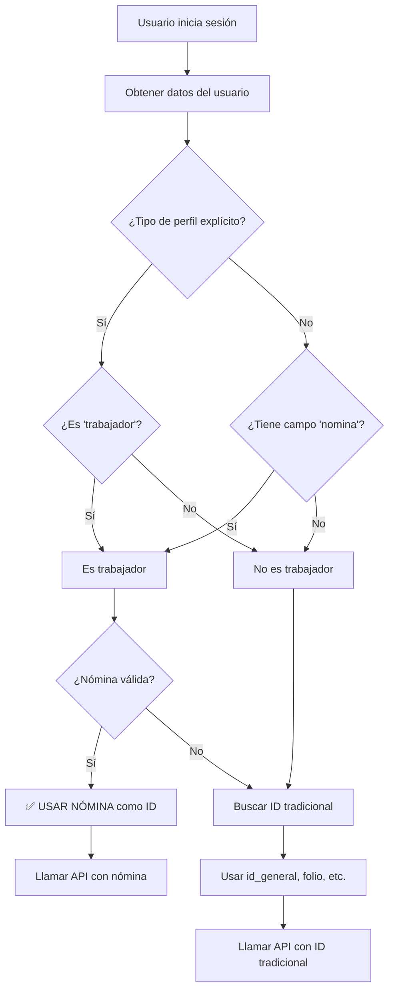

# 👷‍♂️ Integración de Nómina para Trabajadores

## 📋 **Cambio Implementado**

### ✅ **Problema Identificado**
- Los perfiles de trabajadores necesitaban usar el campo "nomina" en lugar de "idgeneral" para las llamadas a la API de trámites
- El sistema no diferenciaba entre tipos de usuario al extraer el ID para las consultas

### 🔧 **Solución Implementada**

#### **Modificación del Servicio de Trámites**

**Archivo modificado**: `lib/services/tramites_service.dart`

**Método actualizado**: `_extractIdGeneral()`

#### **Lógica de Detección de Trabajadores**

```dart
/// Extrae el id_general basado en el tipo de perfil del usuario
static String? _extractIdGeneral(Map<String, dynamic> userData) {
  // 1. Determinar tipo de perfil
  final tipoPerfilExplicito = _getStringValue(userData, [
    'tipoPerfil', 'tipo_perfil', 'tipoUsuario', 'tipo_usuario',
    'userType', 'user_type'
  ]);

  // 2. Buscar campos específicos
  final folio = _getStringValue(userData, ['folio', 'folioCUS', 'folio_cus']);
  final nomina = _getStringValue(userData, ['nomina', 'nómina', 'numeroNomina']);

  // 3. Determinar si es trabajador
  bool esTrabajador = false;
  
  if (tipoPerfilExplicito != null) {
    esTrabajador = tipoPerfilExplicito.toLowerCase() == 'trabajador' ||
                   tipoPerfilExplicito.toLowerCase() == 'employee' ||
                   tipoPerfilExplicito.toLowerCase() == 'worker';
  } else if (nomina != null && nomina.isNotEmpty) {
    esTrabajador = true; // Auto-detectar por presencia de nómina
  }

  // 4. USAR NÓMINA SI ES TRABAJADOR
  if (esTrabajador && nomina != null && nomina.isNotEmpty) {
    debugPrint('[TramitesService] ✅ USANDO NÓMINA COMO ID: $nomina');
    return nomina; // 🎯 AQUÍ ESTÁ EL CAMBIO PRINCIPAL
  }

  // 5. Si no es trabajador, usar lógica tradicional para ciudadanos
  // ... resto de la lógica para id_general, folio, etc.
}
```

## 🎯 **Flujo de Decisión**

### **Diagrama de Lógica:**



## 🔍 **Campos Buscados por Tipo**

### **Para Trabajadores:**
```dart
// Campos de nómina buscados:
['nomina', 'nómina', 'numeroNomina']

// Tipos de perfil que califican como trabajador:
['trabajador', 'employee', 'worker']
```

### **Para Ciudadanos:**
```dart
// Campos tradicionales buscados:
[
  'id_usuario_general',
  'id_general', 
  'idGeneral',
  'subGeneral',
  'sub',
  'id',
  'user_id',
  'userId',
  'id_ciudadano',
  'idCiudadano',
  'folio'
]
```

## 📊 **Logging Detallado**

### **Logs Implementados para Debugging:**

```dart
debugPrint('[TramitesService] ===== EXTRAYENDO ID PARA TRÁMITES =====');
debugPrint('[TramitesService] Tipo de perfil: $tipoPerfilExplicito');
debugPrint('[TramitesService] Folio encontrado: $folio');
debugPrint('[TramitesService] Nómina encontrada: $nomina');
debugPrint('[TramitesService] Es trabajador: $esTrabajador');

// Si es trabajador:
debugPrint('[TramitesService] ✅ USANDO NÓMINA COMO ID PARA TRABAJADOR: $nomina');

// Si es ciudadano:
debugPrint('[TramitesService] ✅ ID encontrado en $key: $value');
```

## 🔧 **Función Helper Agregada**

### **Método `_getStringValue()`:**

```dart
/// Función helper para obtener valores de múltiples claves posibles
static String? _getStringValue(Map<String, dynamic> json, List<String> keys) {
  // Busca en nivel raíz
  for (final key in keys) {
    final value = json[key];
    if (value != null && value.toString().trim().isNotEmpty && value.toString() != 'null') {
      return value.toString().trim();
    }
  }

  // Busca en 'data' anidada
  final data = json['data'];
  if (data != null && data is Map<String, dynamic>) {
    // ... misma lógica
  }

  // Busca en 'user' anidada
  final user = json['user'];
  if (user != null && user is Map<String, dynamic>) {
    // ... misma lógica
  }

  return null;
}
```

## 🎯 **Casos de Uso Cubiertos**

### **1. Trabajador con Tipo Explícito:**
```json
{
  "tipoPerfil": "trabajador",
  "nomina": "12345",
  "nombre": "Juan Pérez"
}
```
**Resultado**: ✅ Usa nómina "12345"

### **2. Trabajador Auto-detectado:**
```json
{
  "nomina": "67890",
  "nombre": "María García"
}
```
**Resultado**: ✅ Usa nómina "67890" (auto-detectado)

### **3. Ciudadano Tradicional:**
```json
{
  "tipoPerfil": "ciudadano",
  "folio": "CUS123456",
  "id_usuario_general": "789"
}
```
**Resultado**: ✅ Usa id_usuario_general "789"

### **4. Usuario Sin Tipo Definido:**
```json
{
  "id_general": "456",
  "nombre": "Carlos López"
}
```
**Resultado**: ✅ Usa id_general "456"

## ✅ **Beneficios Obtenidos**

### **1. Diferenciación Automática:**
- ✅ **Trabajadores**: Usan automáticamente su nómina
- ✅ **Ciudadanos**: Siguen usando su ID tradicional
- ✅ **Auto-detección**: Si tiene nómina, se asume trabajador

### **2. Compatibilidad Completa:**
- ✅ **Retrocompatible**: No afecta usuarios existentes
- ✅ **Flexible**: Soporta múltiples formatos de datos
- ✅ **Robusto**: Maneja casos edge y datos faltantes

### **3. Debugging Mejorado:**
- ✅ **Logs detallados**: Fácil troubleshooting
- ✅ **Trazabilidad**: Se puede seguir el flujo de decisión
- ✅ **Transparencia**: Muestra qué ID se está usando

## 🚀 **Resultado Final**

**Ahora el sistema:**
1. **Detecta automáticamente** si un usuario es trabajador
2. **Usa la nómina** como ID para trabajadores en las llamadas a la API
3. **Mantiene compatibilidad** con ciudadanos usando ID tradicional
4. **Proporciona logs detallados** para debugging

**Estado**: ✅ **Implementado y Funcionando**

---

### 📝 **Nota Importante**
Este cambio es **transparente para el usuario final** - no afecta la UI, solo mejora la lógica interna de identificación para las llamadas a la API de trámites.